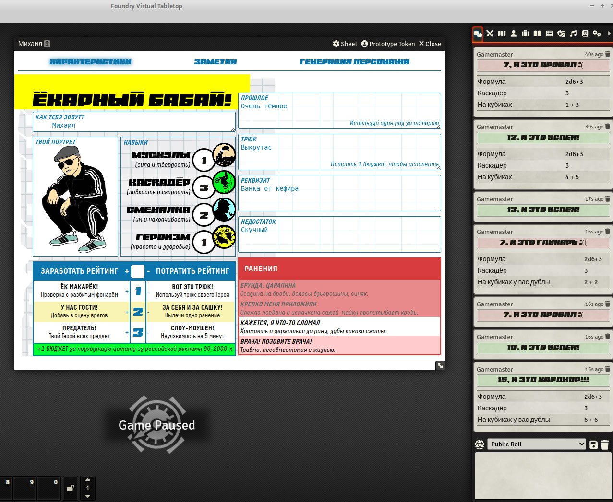

# Ёкарный бабай!

Системя для НРИ Ёкарный бабай! на [Foundry VTT v13](https://foundryvtt.com/ "Что ещё за фаундри такой?") на русском языке. 

Пакет разработан под руководством автора игры [Глеба Мордовцева](https://t.me/nrdsmit)

Пакет в каталоге Foundry VTT: https://foundryvtt.com/packages/yokarny-babay

Книга правил: https://rpgbook.ru/YB_Free

Возможности:

- [x] Лист персонажа
- [x] Броски навыков. Левый клик делает обычный бросок, правый клик на характеристике открывает контекстное меню, давая возможность броска с помехой или преимуществом. 
- [x] Счётчик бюджета синхронизируется между всеми листами персонажа
- [x] Ранения. Левый клик на блоке ранений - добавляет 1 рану, правый клик - снимает 1 рану. 
- [x] Наполнены компендумы с основными таблицами рандомизации
- [X] Опциональная генерация нового персонажа
- [X] Релиз на Foundry VTT v13 (оно и сейчас работает, но там немного съехали стили из-за App v2)
- [X] Дополнение Твой город

>«Ёкарный бабай!» — это настольная ролевая игра Глеба Мордовцева в духе безбашенных российских боевиков. В ней отважные герои пробиваются сквозь толпы врагов, сражаются с опасными злодеями и драматично погибают под грустную музыку. Действие игры разворачивается в начале 2000-х годов — в то время, которое вызывает у нас множество тёплых воспоминаний и ярких ассоциаций.
>
>Для игры понадобятся несколько участников. Один из них становится Режиссёром — он придумывает сцены, в которые попадают герои фильма и строит козни от имени бандитов и их боссов. Остальные игроки исполняют роли главных героев боевика — они бегают, прыгают, сражаются с толпами статистов, противостоят злодеям... и иногда предают товарищей в самый неожиданный момент! 
>
>Снять свой боевик? Нет ничего проще! Соберите свою команду крутых героев и отправляйтесь на разборки с самыми опасными представителями бандитизма. По коням!

## Рабочая версия на Foundy VTT 12
Дополнение с городами не включено. Появилось только с 13й версии. Если прям актуально, внедрю в 12ю, по запросу.

Код: https://github.com/comat0zz/fvtt_yokarny_babay/tree/vtt12-1.0

Пакет: https://github.com/comat0zz/fvtt_yokarny_babay/releases/tag/v1.0

Манифест: https://github.com/comat0zz/fvtt_yokarny_babay/releases/download/v1.0/system.json